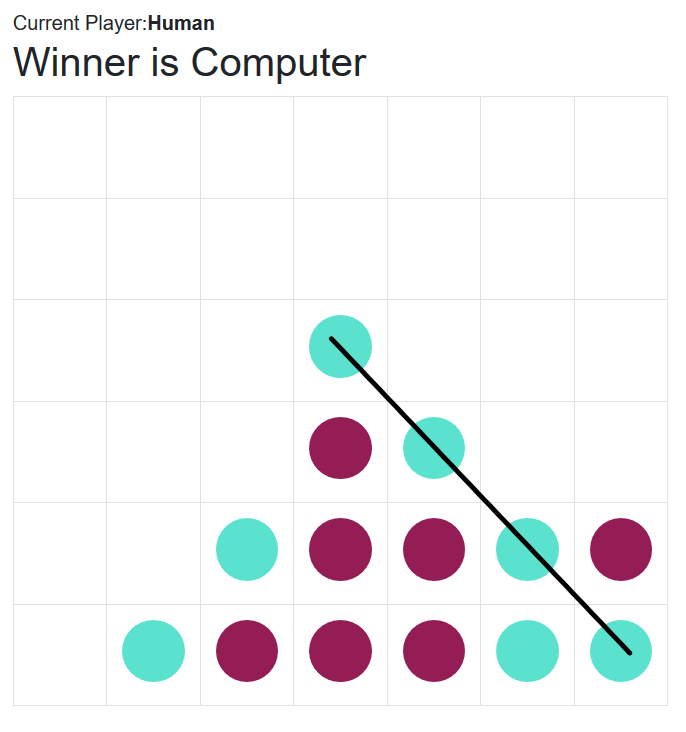

# ConnectFour with [Blazor Server & WebAssembly](https://dotnet.microsoft.com/en-us/apps/aspnet/web-apps/blazor)

Connect Four _(also known as Four in a Row, Four in a Line, Drop Four)_ is a two-player connection board game
in which the players first choose a color and then take turns dropping one colored disc 
from the top into a seven-column, six-row vertically suspended grid. [Read more](https://en.wikipedia.org/wiki/Connect_Four)

## Development

The repository consists of 4 projects:
* ConnectFourLogic: The c# class library contains the core game logic.
* ConnectFourUiLib: Razor component library contains pure UI components
* ConnectFourServer: [Blazor Server](https://learn.microsoft.com/en-us/aspnet/core/blazor/hosting-models?view=aspnetcore-7.0#blazor-server) project 
* ConnectFourWebAssembly: [Blazor WebAssembly](https://learn.microsoft.com/en-us/aspnet/core/blazor/hosting-models?view=aspnetcore-7.0#blazor-webassembly) project

## Status

The ConnectFour is an experimental project with Blazor technology.

Currently, ConnectFour supports only `Easy`-Level game strategy against computer. It could be extended with multi-player and medium/hard level strategies.
